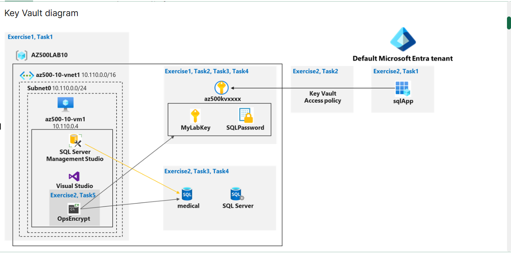

# Lab 07: Azure Key Vault & Always Encrypted

## Overview

In this lab, I implemented Azure Key Vault as a centralised secrets 
management solution and configured Always Encrypted on an Azure SQL 
database to protect sensitive patient data at the column level.

---

## Lab Objectives

- Deploy and configure an Azure Key Vault instance
- Store cryptographic keys and secrets securely in Key Vault
- Register an application in Microsoft Entra ID for secure access
- Configure column-level encryption on an Azure SQL database 
  using Always Encrypted
- Demonstrate that encrypted columns are unreadable without 
  Key Vault access

---

## Architecture
```
Registered App (sqlApp)
        ↓  authenticates via Client ID + Secret
Microsoft Entra ID
        ↓  confirms identity
Azure Key Vault
        ↓  provides Column Master Key
Azure SQL Database (Always Encrypted)
        ↓  SSN + BirthDate columns encrypted/decrypted
C# Console Application
```
**Screenshot:** [Architecture]

---

## Services Used

| Service | Purpose |
|---------|---------|
| Azure Key Vault | Store encryption keys and database secrets |
| Azure SQL Database | Host the medical database with encrypted columns |
| Microsoft Entra ID | App registration for secure Key Vault access |
| Azure Virtual Machine | Host Visual Studio and SSMS for lab execution |
| Always Encrypted | SQL Server feature for column-level encryption |

---

## Steps Completed

### 1. Created the Azure Key Vault

Deployed a Key Vault instance using PowerShell with access 
policies (non-RBAC mode):
```powershell
$kvName = 'az500kv' + $(Get-Random)
$location = (Get-AzResourceGroup -ResourceGroupName 'AZ500Lab10-lod60490694').Location
New-AzKeyVault -VaultName $kvName -ResourceGroupName 'AZ500Lab10-lod60490694' `
  -Location $location -DisableRbacAuthorization
```

**Why:** The Key Vault acts as a centralised, audited store for all 
sensitive values. Using `-DisableRbacAuthorization` enables Access 
Policy mode, giving granular control over who can access keys, 
secrets, and certificates independently.

**Screenshot:** [Key Vault Created]


---

### 2. Configured Access Policies

Set permissions for my user account following the principle of 
least privilege — granting only the permissions required for 
this lab scenario.

**Why:** By default, even the vault creator has no access to 
its contents. Access must be explicitly granted. This enforces 
zero-trust principles — nothing is trusted by default.

**Screenshot:** [Access Policy Configured]


---

### 3. Added a Cryptographic Key
```powershell
$kv = Get-AzKeyVault -ResourceGroupName 'AZ500Lab10-lod60490694'
$key = Add-AzKeyVaultKey -VaultName $kv.VaultName -Name 'MyLabKey' -Destination 'Software'
```

**Why:** This key serves as the Column Master Key (CMK) for Always 
Encrypted. Storing it in Key Vault means the database never handles 
the key directly — even a database administrator cannot decrypt the 
data without Key Vault access.

**Screenshot:** [Key Created]


---

### 4. Added a Secret (SQL Password)
```powershell
$secretvalue = ConvertTo-SecureString 'Pa55w.rd1234' -AsPlainText -Force
$secret = Set-AzKeyVaultSecret -VaultName $kv.VaultName -Name 'SQLPassword' -SecretValue $secretvalue
```

**Why:** Storing the database password as a Key Vault secret 
prevents it from being hardcoded in application code. This 
eliminates credential leakage risks — a leading cause of 
real-world cloud breaches.

**Screenshot:** [Secret Created]


---

### 5. Registered Application in Microsoft Entra ID

Created an app registration (sqlApp) to give the C# console 
application a verified identity for authenticating to Key Vault.

**Why:** Key Vault doesn't hand out keys to anonymous callers. 
The application must prove its identity using a Client ID and 
Client Secret before receiving access. This is equivalent to 
a service account with controlled permissions.

**Security note:** In production, this would use a Managed 
Identity instead — eliminating the need for a Client Secret 
entirely and removing any credential that could be leaked.

---

### 6. Configured Always Encrypted on SQL Database

Using the Always Encrypted wizard in SQL Server Management Studio, 
I encrypted two columns in the Patients table:

| Column | Encryption Type | Reason |
|--------|----------------|--------|
| SSN | Deterministic | Allows equality searches on SSN |
| BirthDate | Randomized | Maximum security, no need to search |

The Column Master Key was stored directly in Azure Key Vault 
during the wizard configuration.

**Screenshot:** [Always Encrypted Results]


---

### 7. Verified Encryption

Queried the database directly via SSMS without Key Vault access:
```sql
SELECT FirstName, LastName, SSN, BirthDate FROM Patients;
```

Result: SSN and BirthDate columns returned as encrypted 
ciphertext — completely unreadable.

Then ran the C# application with Key Vault access — same query 
returned fully readable, decrypted data.

**Screenshot:** [Encrypted Query Result]


---

## Key Security Concepts Demonstrated

**Principle of Least Privilege**  
Each identity (my user account, the sqlApp) received only the 
minimum permissions required for its specific function.

**Separation of Duties**  
The encryption keys are managed in Key Vault separately from 
the database. A database admin and a key vault admin are 
different roles — neither can access the other's domain alone.

**Defence in Depth**  
Even if an attacker gains direct database access, the sensitive 
columns remain encrypted and unreadable without a separate 
Key Vault access grant.

**Zero Trust**  
No identity is trusted by default. Every access to Key Vault 
is explicitly granted and fully logged.

---

## Real-World Relevance

This pattern is used in production environments that handle:
- Patient health records (HIPAA compliance)
- Payment card data (PCI-DSS compliance)  
- Personal identification data (GDPR compliance)

In a real deployment, the Client ID + Secret authentication 
used in this lab would be replaced with **Managed Identities** 
to eliminate credentials from code entirely.

---

## What I Learned

- How Key Vault enforces zero-trust access to sensitive material
- The difference between deterministic and randomized encryption
- Why separating key management from data storage is a security
  best practice
- How an application authenticates to Azure services using 
  Entra ID app registrations
- The real-world risk of hardcoded credentials and how Key Vault 
  solves it
